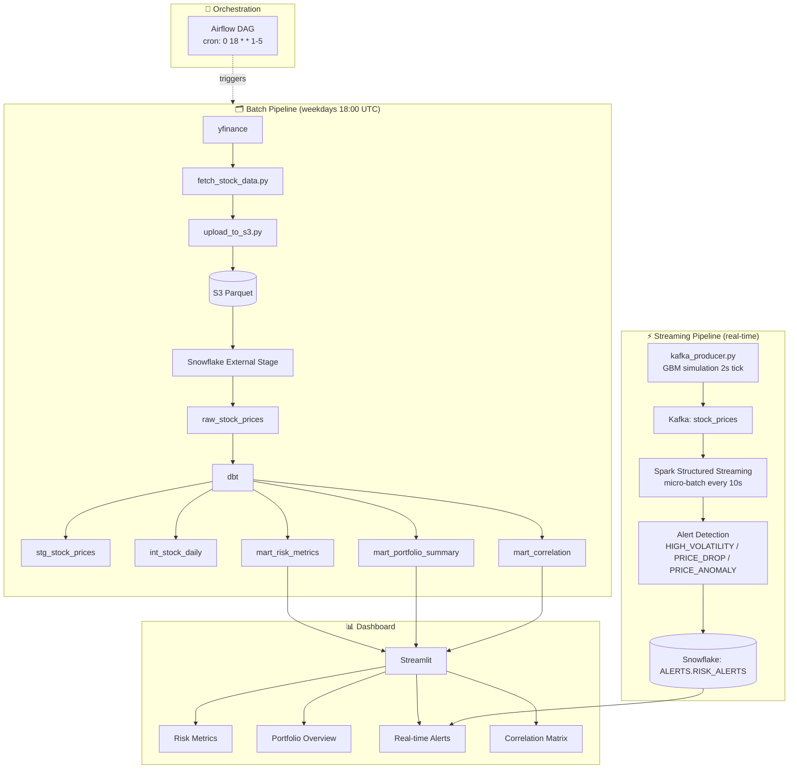

# 🏴󠁧󠁢󠁳󠁣󠁴󠁿 Scottish Equity Risk Pipeline

An end-to-end data engineering portfolio project that tracks **8 Scottish-listed equities**, computes daily risk metrics through a batch dbt pipeline, streams simulated real-time prices through Kafka and Spark, and surfaces everything in a Streamlit dashboard backed by Snowflake.

---
## Business Problem

This project simulates a real-world equity risk monitoring system for
a portfolio of 8 Scottish-listed equities:

- Portfolio managers need daily risk metrics (volatility, VaR 95%, max drawdown)
  to assess exposure and make informed allocation decisions
- Risk teams require real-time alerts when price movements breach defined
  thresholds (high volatility, sudden drops, statistical anomalies)
- A unified batch + streaming architecture enables both historical analysis
  and live monitoring within a single data platform

----

## Architecture



---

## Tech Stack

| Layer | Technology |
|---|---|
| Ingestion | Python 3, yfinance |
| Object Storage | AWS S3 (eu-west-2), Parquet |
| Data Warehouse | Snowflake (Standard) |
| Transformation | dbt-snowflake |
| Orchestration | Apache Airflow (local) |
| Streaming Broker | Apache Kafka (Confluent 7.5.0) |
| Stream Processing | Apache Spark Structured Streaming 3.5 |
| Infrastructure | Docker, Docker Compose |
| Dashboard | Streamlit, Plotly |

---

## Equities Tracked

| Ticker | Company |
|---|---|
| `NWG.L` | NatWest Group |
| `ABDN.L` | abrdn plc |
| `SMT.L` | Scottish Mortgage Investment Trust |
| `MNKS.L` | Monks Investment Trust |
| `AV.L` | Aviva |
| `HIK.L` | Hikma Pharmaceuticals |
| `SSE.L` | SSE plc |
| `WEIR.L` | Weir Group |

---

## Project Structure

```
scottish-equity-risk-pipeline/
├── .github/
│   └── workflows/
│       └── ci_cd.yml               # GitHub Actions: run dbt test on every push
├── batch/
│   ├── ingestion/
│   │   ├── fetch_stock_data.py        # Pull 1-year OHLCV data from yfinance
│   │   └── upload_to_s3.py            # Upload Parquet to S3 (partitioned by date)
│   ├── airflow/
│   │   └── dags/
│   │       └── daily_pipeline.py      # Airflow DAG: fetch → upload → dbt run
│   └── equity_risk/                   # dbt project (profile: equity_risk)
│       ├── models/
│       │   ├── staging/
│       │   │   ├── _sources.yml       # Source definition + data quality tests
│       │   │   └── stg_stock_prices.sql
│       │   ├── core/
│       │   │   ├── int_stock_daily.sql
│       │   │   └── schema.yml         # Data quality tests for core layer
│       │   └── marts/
│       │       ├── mart_correlation.sql    # Pairwise return correlations (28 pairs)
│       │       ├── mart_risk_metrics.sql
│       │       ├── mart_portfolio_summary.sql
│       │       └── schema.yml         # Data quality tests for marts layer
│       ├── dbt_project.yml
│       └── packages.yml               # dbt-utils 1.3.3 dependency
├── streaming/
│   ├── kafka_producer.py              # Simulated price feed (GBM, 2s tick)
│   ├── spark_streaming.py             # Spark consumer + alert writer to Snowflake
│   ├── init_kafka_topics.py           # One-time topic creation script
│   └── requirements_streaming.txt
├── dashboard/
│   └── streamlit_app.py               # 4-page Streamlit dashboard
├── docker/
│   └── docker-compose.yml             # Zookeeper + Kafka + Kafka UI + Spark cluster
├── sql/
│   └── snowflake/
│       ├── 04_raw_tables.sql          # Snowflake setup: warehouse, schemas, stage, COPY INTO
│       └── create_alerts_table.sql    # ALERTS.RISK_ALERTS table DDL
├── requirements.txt
└── README.md
```

---

## Snowflake Schema

```
EQUITY_DB
├── RAW
│   └── raw_stock_prices          # Raw OHLCV data loaded from S3
├── STAGING_STAGING               # dbt staging layer
│   └── stg_stock_prices          # Cleaned view on raw_stock_prices
├── STAGING_CORE                  # dbt core layer
│   └── int_stock_daily           # Daily returns (LAG-based)
├── STAGING_MARTS                 # dbt marts layer
│   ├── mart_risk_metrics         # Volatility, VaR 95%, max daily loss/gain
│   └── mart_portfolio_summary    # Latest close, avg price, volume per symbol
└── ALERTS
    └── risk_alerts               # Real-time alerts from Spark Streaming
```

> **Note on schema naming:** dbt automatically prefixes all schemas with the target schema
> defined in `profiles.yml` (set to `STAGING` for the dev environment). This results in
> `STAGING_STAGING`, `STAGING_CORE`, and `STAGING_MARTS` in Snowflake. This prefix is
> intentional for dev/test environment isolation. In production, the prefix can be
> overridden via the `schema` config in `profiles.yml` to produce clean schema names
> (`STAGING`, `CORE`, `MARTS`).

### Key Columns

**`STAGING_MARTS.MART_RISK_METRICS`**
`SYMBOL` · `TRADING_DAYS` · `AVG_DAILY_RETURN_PCT` · `DAILY_VOLATILITY_PCT` · `ANNUAL_VOLATILITY_PCT` · `MAX_DAILY_LOSS_PCT` · `MAX_DAILY_GAIN_PCT` · `VAR_95_PCT`

**`STAGING_MARTS.MART_PORTFOLIO_SUMMARY`**
`SYMBOL` · `TRADING_DAYS` · `AVG_CLOSE` · `MIN_CLOSE` · `MAX_CLOSE` · `AVG_VOLUME` · `LATEST_CLOSE` · `LATEST_DATE`

**`STAGING_MARTS.MART_CORRELATION`**
`SYMBOL_1` · `SYMBOL_2` · `CORRELATION`

**`ALERTS.RISK_ALERTS`**
`ALERT_ID` · `SYMBOL` · `ALERT_TYPE` · `METRIC_VALUE` · `THRESHOLD_VALUE` · `PRICE_AT_ALERT` · `TRIGGERED_AT`

---

## Prerequisites

- Python 3.10+
- Docker Desktop
- Apache Airflow (local standalone install)
- Snowflake account
- AWS account with S3 access
- dbt-snowflake (`pip install dbt-snowflake==1.11.3`)

---

## Setup & Installation

### 1. Clone the repository

```bash
git clone https://github.com/<your-username>/scottish-equity-risk-pipeline.git
cd scottish-equity-risk-pipeline
```

### 2. Create a virtual environment and install dependencies

```bash
python -m venv .venv
source .venv/bin/activate
pip install -r requirements.txt
pip install -r streaming/requirements_streaming.txt
```

### 3. Configure environment variables

Create a `.env` file in the project root:

```env
# AWS
AWS_REGION=eu-west-2
S3_BUCKET_NAME=scottish-equity-risk-pipeline-526860034407-eu-west-2-an

# Snowflake
SNOWFLAKE_ACCOUNT=MOQNKPX-BU34698
SNOWFLAKE_USER=EMMA
SNOWFLAKE_PASSWORD=<your_password>
SNOWFLAKE_WAREHOUSE=EQUITY_WH
SNOWFLAKE_DATABASE=EQUITY_DB
SNOWFLAKE_ROLE=ACCOUNTADMIN
```

### 4. Set up Snowflake infrastructure

Run the SQL scripts in Snowflake in order:

```bash
# In Snowflake UI or VS Code Snowflake extension:
sql/snowflake/04_raw_tables.sql       # Creates warehouse, schemas, stage, loads raw data
sql/snowflake/create_alerts_table.sql # Creates ALERTS.RISK_ALERTS table
```

### 5. Configure dbt

Create `~/.dbt/profiles.yml`:

```yaml
equity_risk:
  target: dev
  outputs:
    dev:
      type: snowflake
      account: MOQNKPX-BU34698
      user: EMMA
      password: <your_password>
      role: ACCOUNTADMIN
      database: EQUITY_DB
      warehouse: EQUITY_WH
      schema: STAGING
      threads: 4
```

Verify the connection:

```bash
cd batch/equity_risk
dbt debug
```

---

## Running the Pipeline

### Batch pipeline (manual run)

```bash
# Step 1 — Fetch stock data
source .venv/bin/activate
python batch/ingestion/fetch_stock_data.py

# Step 2 — Upload to S3
python batch/ingestion/upload_to_s3.py

# Step 3 — Run dbt models
cd batch/equity_risk
dbt run
```

### Batch pipeline (via Airflow)

```bash
# Start Airflow standalone (first time only: airflow db init)
airflow standalone
```

Then open [http://localhost:8080](http://localhost:8080) and enable the `scottish_equity_daily_pipeline` DAG. It runs automatically on weekdays at 18:00 UTC. The three tasks run in sequence:

```
fetch_stock_data >> upload_to_s3 >> dbt_run
```

### Streaming pipeline

**Step 1 — Start the Docker infrastructure** (Zookeeper, Kafka, Spark):

```bash
docker-compose -f docker/docker-compose.yml up -d
```

Check all services are healthy:

```bash
docker-compose -f docker/docker-compose.yml ps
```

| Service | URL |
|---|---|
| Kafka UI | http://localhost:8080 |
| Spark Master UI | http://localhost:8081 |
| Spark Worker UI | http://localhost:8082 |

**Step 2 — Initialise Kafka topics** (one-time):

```bash
python streaming/init_kafka_topics.py
```

This creates two topics: `stock_prices` (3 partitions, 24h retention) and `risk_alerts` (1 partition, 7-day retention).

**Step 3 — Start the Kafka producer**:

```bash
python streaming/kafka_producer.py
```

Simulates real-time price ticks for all 8 equities every 2 seconds using Geometric Brownian Motion, publishing to the `stock_prices` topic.

**Step 4 — Start Spark Streaming**:

```bash
cd streaming
spark-submit \
  --packages org.apache.spark:spark-sql-kafka-0-10_2.12:3.5.0 \
  spark_streaming.py
```

Spark processes micro-batches every 10 seconds and writes alerts to `EQUITY_DB.ALERTS.RISK_ALERTS` when any of these thresholds are breached:

| Alert Type | Trigger Condition |
|---|---|
| `HIGH_VOLATILITY` | Rolling volatility > 2% of avg price |
| `PRICE_DROP` | Price falls > 3% from window high |
| `PRICE_ANOMALY` | Price deviates > 2 standard deviations from mean |

**Stop the infrastructure**:

```bash
docker-compose -f docker/docker-compose.yml down
```

### Dashboard

```bash
# From the project root
streamlit run dashboard/streamlit_app.py
```

Opens at [http://localhost:8501](http://localhost:8501). Three pages:

| Page | Data Source | Content |
|---|---|---|
| **Risk Metrics** | `STAGING_MARTS.MART_RISK_METRICS` | Annualised volatility, VaR 95%, max daily loss/gain per symbol |
| **Portfolio Overview** | `STAGING_MARTS.MART_PORTFOLIO_SUMMARY` | Latest close prices vs historical average, volume by symbol |
| **Real-time Alerts** | `ALERTS.RISK_ALERTS` | Live alert log with symbol/type filters and timeline chart |
| **Correlation Matrix** | `STAGING_MARTS.MART_CORRELATION` | Pairwise return correlation heatmap for all 8 equities |
---

## dbt Models

| Model | Layer | Materialisation | Description |
|---|---|---|---|
| `stg_stock_prices` | Staging | View | Cleaned pass-through from `RAW.raw_stock_prices` |
| `int_stock_daily` | Core | Table | Daily returns computed via `LAG()` window function |
| `mart_risk_metrics` | Marts | Table | Volatility, annualised volatility, VaR 95% (`PERCENTILE_CONT(0.05)`), max loss/gain |
| `mart_portfolio_summary` | Marts | Table | Latest close, avg/min/max price, avg volume per symbol |
| `mart_correlation` | Marts | Table | Pairwise return correlations for all 28 equity pairs (`CORR()`) |

Run all models:

```bash
cd batch/equity_risk
dbt run
```

Run a specific model:

```bash
dbt run --select mart_risk_metrics
```

---

## Data Quality & CI/CD

### dbt Tests

Data quality is enforced via dbt's built-in test framework across all model layers,
including structural integrity checks and financial business logic validation:

| Layer | Model | Tests |
|---|---|---|
| Source | `raw_stock_prices` | `not_null` on `date`, `symbol`, `close`; `close >= 0` |
| Core | `int_stock_daily` | `not_null` on `symbol`, `date` |
| Marts | `mart_risk_metrics` | `not_null` + `unique` on `symbol`; `daily_volatility_pct >= 0`; `var_95_pct <= 0` |
| Marts | `mart_portfolio_summary` | `not_null` + `unique` on `symbol`; `latest_close >= 0` |
| Marts | `mart_correlation` | `not_null` on `symbol_1`, `symbol_2`, `correlation`; `correlation` ∈ `[-1, 1]` |

Business logic tests use `dbt_utils.expression_is_true` (dbt-labs/dbt_utils 1.3.3).

Run tests manually:
```bash
cd batch/equity_risk
dbt test
```
---

### CI/CD — GitHub Actions

Every push to `main` automatically triggers a two-stage CI/CD pipeline via GitHub Actions (`.github/workflows/ci_cd.yml`):

**CI — `dbt-test` job** (runs on every push and PR):
1. Sets up Python 3.11
2. Installs `dbt-snowflake==1.11.3`
3. Injects Snowflake credentials from GitHub Secrets
4. Runs `dbt test` against the live Snowflake warehouse

**CD — `dbt-deploy` job** (runs on push to `main` only, after `dbt-test` passes):
1. Rebuilds the dbt profile targeting the production `MARTS` schema
2. Runs `dbt run --target prod` to deploy all models to Snowflake

Snowflake credentials are stored as GitHub repository secrets: `SNOWFLAKE_ACCOUNT`, `SNOWFLAKE_USER`, `SNOWFLAKE_PASSWORD`.

---

## Infrastructure Notes

- **Airflow** runs locally as a standalone process, not inside Docker.
- **Spark Streaming** runs on the host machine via `spark-submit`, connecting to the Kafka broker at `localhost:9092`.
- **Docker Compose** uses `apache/spark:3.5.6` — `bitnami/spark` was removed from Docker Hub and is no longer used.
- The old `streaming/docker-compose-kafka.yml` has been replaced by `docker/docker-compose.yml`.
- Kafka's dual-listener setup (`INTERNAL://kafka:29092`, `EXTERNAL://localhost:9092`) allows both Docker containers and host-machine scripts to connect.

---

## Key Design Decisions

**VaR 95% calculation** — computed using `PERCENTILE_CONT(0.05) WITHIN GROUP (ORDER BY daily_return)` in SQL, which returns the 5th percentile of daily log returns. This represents the worst expected daily loss at 95% confidence.

**GBM price simulation** — the Kafka producer uses Geometric Brownian Motion (`P(t+1) = P(t) * exp(σ * ε)`) rather than simple random walks. This ensures prices stay positive and percentage changes follow a normal distribution, consistent with the Black-Scholes model.

**Partitioned S3 storage** — data is written to `raw/stock_prices/dt=YYYY-MM-DD/stock_prices.parquet`, enabling partition pruning when querying historical date ranges.

**Nanosecond timestamp fix** — yfinance returns dates as nanosecond BIGINT values in Parquet. The Snowflake `COPY INTO` statement converts them via `TO_DATE(TO_TIMESTAMP($1:date::BIGINT / 1000000000))`.

**Batch vs streaming architecture** — the pipeline deliberately runs two separate risk calculation paths. The batch layer (dbt) computes accurate historical metrics from a full year of clean OHLCV data, optimised for reporting and dashboard queries. The streaming layer (Spark) detects real-time anomalies from simulated tick data within 10-second micro-batches, optimised for low-latency alerting. Separating the two avoids forcing a streaming system to maintain long historical windows, and avoids forcing a batch system to meet latency requirements it was not designed for.

**Cost optimisation** — the Snowflake warehouse (`EQUITY_WH`) is configured with `AUTO_SUSPEND = 60` seconds and `AUTO_RESUME = TRUE`, ensuring compute only runs when queries are active. The Kafka topic `stock_prices` uses a 24-hour retention window, retaining only the data needed for real-time processing without accumulating unbounded storage. The `risk_alerts` topic uses a 7-day retention window to allow alert replay if the Spark consumer restarts.

**Spark Streaming fault tolerance** — the Spark Structured Streaming job uses checkpointing
to persist its progress metadata to a local directory. This ensures that if the consumer
restarts, it resumes from where it left off without reprocessing or skipping messages.

---

## Scalability

The pipeline is designed to be ticker-agnostic. Equities are defined in a single
configuration list and can be extended without modifying the pipeline logic. dbt models
operate on `symbol` partitions, allowing horizontal scaling as the universe of equities
grows. Kafka topics use 3 partitions on `stock_prices`, enabling parallel ingestion for
larger symbol sets. Snowflake's elastic compute scales independently of storage.

---

## Observability

Structured logging is implemented in the Airflow DAG via three callbacks:

- **Task success**: logs task name, execution date, and duration in seconds
- **Task failure**: logs task name, execution date, duration, and retry attempt number
- **Pipeline completion**: logs a `[PIPELINE COMPLETE]` entry when all tasks succeed

All log entries follow a consistent `[STATUS] DAG | Task | Execution | Duration` format, queryable via the Airflow UI task logs.

**Future work:**
- Track data freshness metrics
- Integrate alerting for pipeline failures via Slack or email
- Expose dbt test results as metrics for dashboarding
---

## Disclaimer

This project is built for portfolio purposes only.  
Stock data is sourced via [yfinance](https://github.com/ranaroussi/yfinance), 
which retrieves publicly available market data from Yahoo Finance.  
This project is not intended for commercial use.
